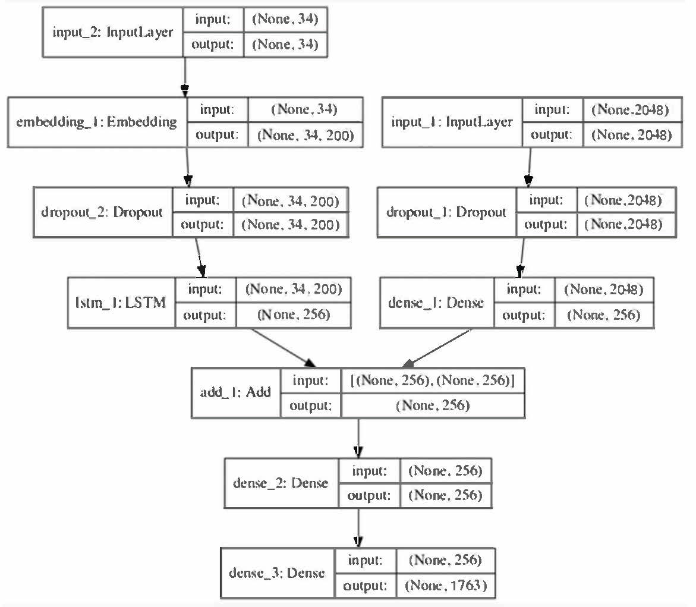

# Image Caption Generator

Generates textual description of any given image. Use both **Natural Language Processing (NLP)** and **Computer Vision** to generate captions. The idea implemented is to replace the encoder (RNN layer) in an encoder-decoder architecture with a deep **Convolutional Neural Network (CNN)** trained to classify objects in images.

## Table of Contents

- [Image Caption Generator](#image-caption-generator)
  - [Table of Contents](#table-of-contents)
  - [Learn Concepts](#learn-concepts)
    - [Keras Implementation](#keras-implementation)
    - [Detailed Study and Explanation](#detailed-study-and-explanation)
    - [ResNet Model](#resnet-model)
    - [InceptionV3 Model](#inceptionv3-model)
    - [TensorFlow-Keras Applications API](#tensorflow-keras-applications-api)
  - [RNN MODEL TRAINED](#rnn-model-trained)
  - [Try Locally](#try-locally)
  - [Dataset Resource](#dataset-resource)
- [Node.js REST API](#nodejs-rest-api)
  - [Prerequisites](#prerequisites)
  - [Installation](#installation)
  - [Useful Scripts for Local Development](#useful-scripts-for-local-development)
    - [`npm run start:dev`](#npm-run-startdev)
    - [`npm run start:server`](#npm-run-startserver)
    - [`npm run build:prod`](#npm-run-buildprod)
- [License](#license)
- [Author](#author)

## Learn Concepts

### Keras Implementation

https://towardsdatascience.com/image-captioning-with-keras-teaching-computers-to-describe-pictures-c88a46a311b8

### Detailed Study and Explanation

https://data-flair.training/blogs/python-based-project-image-caption-generator-cnn/

### ResNet Model

https://towardsdatascience.com/review-resnet-winner-of-ilsvrc-2015-image-classification-localization-detection-e39402bfa5d8

### InceptionV3 Model

https://medium.com/@sh.tsang/review-inception-v3-1st-runner-up-image-classification-in-ilsvrc-2015-17915421f77c

### TensorFlow-Keras Applications API

https://www.tensorflow.org/api_docs/python/tf/keras/

## RNN MODEL TRAINED



## Try Locally

Make sure you have [**python**](https://www.python.org/downloads/ "Download Python") installed on your system.\
I have used [**pipenv**](https://pypi.org/project/pipenv/) to manage virtual environment and packages.\
You can install **pipenv** using [**pip**](https://pip.pypa.io/en/stable/user_guide/ "Pip Docs") by running

```sh
$ python -m pip install pipenv
```

Now clone this repo and install all the dependencies

```sh
$ git clone https://github.com/Smile040501/image_captioning.git

$ cd image_captioning/

$ pipenv install --dev
```

Once all the packages are installed, you may try running one of the following commands

```sh
# To generate predicted captions for all the dev dataset images
$ pipenv run python generate_caption.py generate

# To generate a prediction for provided image
$ pipenv run python generate_caption.py image <path_to_image>
```

Or you may use try using [**Jupyter Notebooks**](./Python/Notebooks/ "My Jupyter Notebooks").\
_(Make sure to select python interpreter as installed by **pipenv**)_

## Dataset Resource

-   [**Flicker8k_Dataset.zip**](https://github.com/jbrownlee/Datasets/releases/download/Flickr8k/Flickr8k_Dataset.zip "Download")

-   [**Flicker8k_text.zip**](https://github.com/jbrownlee/Datasets/releases/download/Flickr8k/Flickr8k_text.zip "Download")

-   [**glove.6B.zip**](https://nlp.stanford.edu/data/glove.6B.zip "Download")

<br>

# Node.js REST API

Node.js REST API for the project to make requests from frontend and predict caption for uploaded image from frontend.

## Prerequisites

This project requires [NodeJS](http://nodejs.org/ "NodeJS") (version 8 or later) and [NPM](https://npmjs.org/ "NPM").

To make sure you have them available on your machine,
try running the following command.

```sh
$ npm -v
7.20.3

$ node -v
v14.17.4
```

## Installation

**BEFORE YOU INSTALL :** Please read the [Prerequisites](#prerequisites).

Start with cloning this repo on your local machine, copying this template folder to destination folder and installing dependencies.

```sh
$ git clone https://github.com/Smile040501/image_captioning.git

$ cd image_captioning/

$ npm install
```

## Useful Scripts for Local Development

In the project directory, you can run:

### `npm run start:dev`

Runs the app in the development mode.\
You can make request to [http://localhost:8000](http://localhost:8000/)\
It will bundle the app using [webpack](https://webpack.js.org/) to `build` folder and serve it using [nodemon](https://nodemon.io/).\
It will re-bundle whenever you make edits to any of the development file.

### `npm run start:server`

Will serve the app using [nodemon](https://nodemon.io/).\
Make sure the app was build before webpack at least once and `build` folder exists.

### `npm run build:prod`

Builds the app for production to the `build` folder.\
It correctly bundles the app in production mode and optimizes the build for the best performance.

The build is minified.\
Your app is ready to be deployed!

# License

[MIT](LICENSE)

# Author

<a href="https://github.com/Smile040501">
    
</a>

**Mayank Singla**

-   [**GitHub**](https://github.com/Smile040501)
-   [**LinkedIn**](https://www.linkedin.com/in/mayank-singla-001pt)
